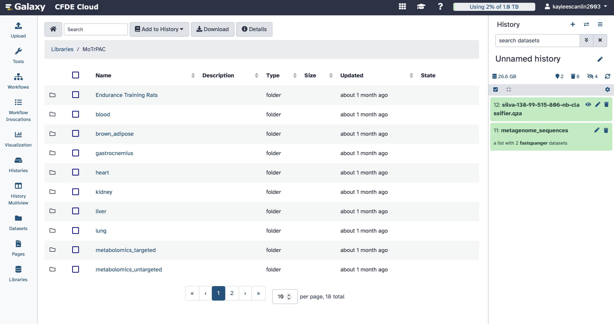

Visualizations
==============
Galaxy provides a suite of built-in visualization tools that enable users to interactively explore the contents of their datasets. These tools support a range of formats and outputs, including quality control reports (e.g., FastQC), taxonomy barplots (e.g., from QIIME2), scatterplots, and genome browsers (e.g., Trackster).

Visualizations are particularly useful for interpreting results without needing to export data to external programs, enhancing efficiency and reproducibility in data analysis.

Histories & History Multiview
=================
The History Multiview feature allows users to open and compare multiple histories simultaneously. This interface is particularly valuable for collaborative work, side-by-side comparisons of different workflow runs, or managing large-scale analyses across various datasets.

Users can easily drag and drop datasets between histories, examine the lineage of results, and ensure consistency across different analysis branches.

Datasets
==========================

This tab shows all of the datasets you have uploaded or interacted with. 

.. note::
    **Point of confusion:**
    This is not a list of all datasets you can currently work with–these will be present in the history sidebar on the right. Instead, this is all of the datasets that have ‘passed through’ the CFDE workspace across all histories.

**Deleting datasets**
If you click the trash icon in your history tab, you will delete the dataset from your history, making it inaccessible to the current workflow. However, it will still exist on your disk allocation and will take up disk space. To completely delete a dataset from the disk allocation, you must purge it.

**Purging datasets**
To purge a dataset, you must first delete it from your history. Then, if you want to permanently remove the dataset from your storage quota:

1. Click the gear icon (⚙️) in the History panel (top right of the history list).

2. Select “Purge Deleted Datasets” to free up space.

The amount of bytes you are using should change to reflect this in the top right:

.. image:: _static/datasets-images/datasets1.png
   :alt: Creating a workflow
   :align: center
   :width: 1200px

*Example - this is an example of how many bytes are used. It will not necessarily reflect the amount of bytes that are in your CFDE allocation, though after purging a dataset, the amount of bytes you are using should decrease.

Pages
=====
Pages are interactive, web-based documents that allow users to present and share their analyses in a readable format. You can embed datasets, visualizations, workflow outputs, and add formatted text using Markdown. This makes Pages ideal for creating lab reports, tutorials, or summaries of workflow results.

For example, after running an ARG detection workflow, you could use a Page to present FastQC results, describe your pipeline, and share the page with collaborators or the public via a link.

Libraries
=========
Libraries function as shared storage areas where datasets can be centrally curated and accessed by multiple users. Unlike individual histories, datasets in Libraries are organized into folders, can include metadata, and typically have controlled permissions.

Users can import data from a Library into their own Galaxy history without affecting the original files. This makes Libraries particularly useful in teaching environments or collaborative research projects where consistency and access control are important.

   
As you can see, the only pre-installed library in the CFDE workspace is the **MoTrPAC**, a collaborative project that collects and analyzes biological samples from both humans and animal models before and after physical activity.

You have now reached the end of the documentation website.
----------------------------------------------------------
Happy analyzing!
