Sidebar tools
=============
This page walks you through each tool on the sidebar to the far right of the CFDE workspace:

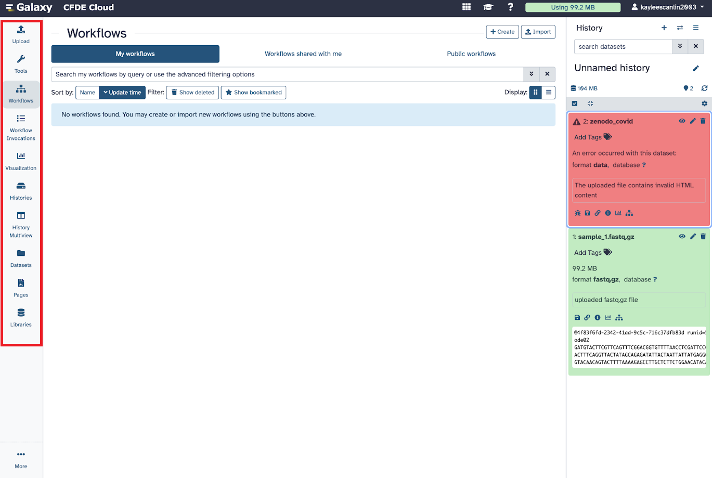

Upload
======

The upload bar allows you to upload datasets to the CFDE workspace. It is a convenient way to upload and access large datasets you need available on CFDE machines. 

For additional tutorials on running machine learning processes on these datasets, see **Creating Your Own Workflow.**

Uploading a dataset
---------------------

To upload a dataset, click on Upload. There should be four options available to you:

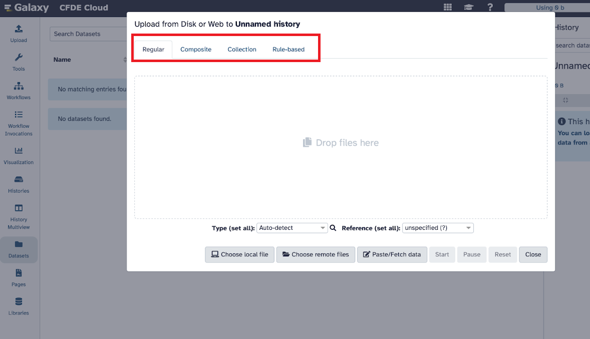

- **Regular** – for uploading singular flat files (e.g., `.CSV`, `.TXT`, or `.FASTQ`)

  - You can choose to upload locally (from your machine) or remotely.
  - You can also try parsing/fetching the data from a web URL.

- **Composite** – for datasets made of multiple files but treated as one singular unit (e.g., `.bt2`, `.fa`)

  - These will also be immediately available under “Datasets”.

- **Collection** – for datasets composed of multiple files that need to be uploaded as separate datasets,
  such as in the case of pairs or lists (e.g., batch processing or sampling)

- **Rule-based upload** – for when you need advanced collections that are built dynamically with metadata in mind.

.. note::
    For more information about uploading Rule-based datasets to the CFDE Galaxy, look here:
    https://training.galaxyproject.org/training-material/topics/galaxy-interface/tutorials/upload-rules/tutorial.html

    For assistance troubleshooting data uploads, click the question mark in the upper right corner for community support.

To see a full tutorial for uploading a dataset and running a machine learning process on it, see **Creating Your Own Workflow.**

Tools
-----
This opens the preexisting library of NIH-created analysis tools. A majority of the data analysis will be done here.

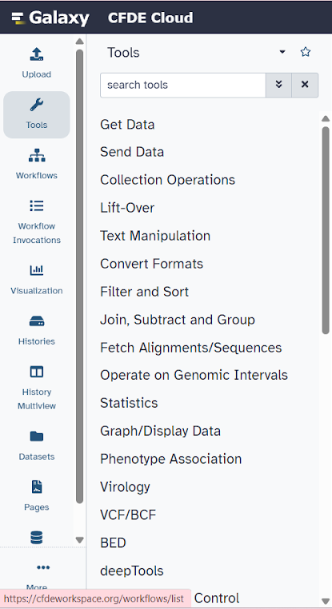

Because of the volume of tools in the CFDE galaxy interface, there is a search bar for ease of finding.

**Tool Interface**
Most tools in this interface will contain:
- Input datasets and parameters
- Help, citations, & metadata
- A run tool button, which will add output datasets to the history

**New Versions**
New versions of tools can be installed without removing old ones to ensure reproducibility.

**Adding Tools**
To add tools you may not see in the CWIC interface, go to the Galaxy Tool Shed: https://toolshed.g2.bx.psu.edu/
And ask your Galaxy Admin to install it for you. There is currently no way for users to add their own tools to the CFDE workspace.

Workflows
---------
**Workflows** are saved, pre-existing pipelines for data processing and analysis. Each step takes an input (dataset), sends it to a tool for one part of the processing pipeline, and then hands it off to the next tool for the next part. 

The CFDE galaxy workspace does not come with pre-installed workflows–when you open the workflow space, you should see that they are empty:
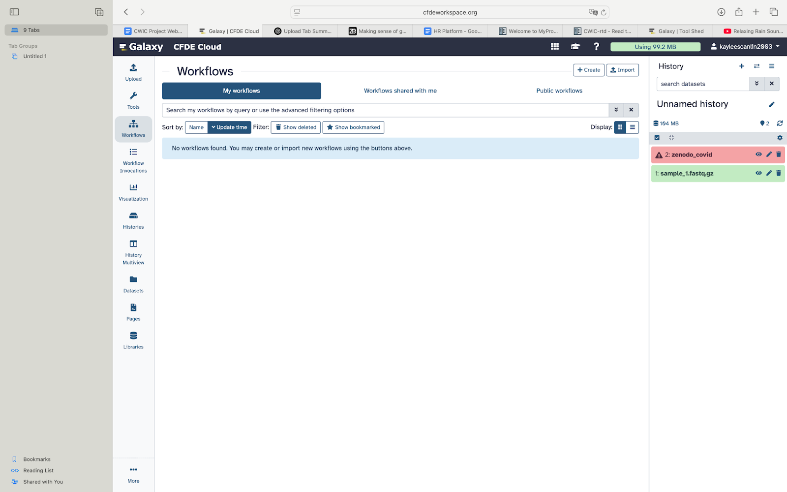

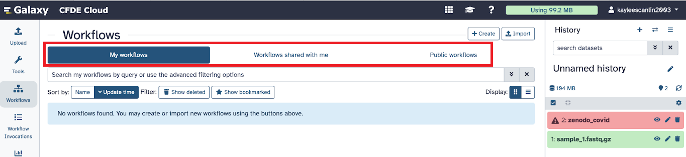

**My Workflows**
This is where you can find workflows you have installed into your Galaxy workspace. 

**Workflows Shared with Me**
This is where you can find workflows you have with other people. 

**Public Workflows**
Public workflows are ones publicly-available for anyone to download.
Because the CFDE galaxy is still in development, there are currently no workflows available for download.

Creating/Importing workflows
----------------------------
To the far right of the Workflows tab, you should see two buttons create and import. These are currently the only way to get a workflow pipeline into the CFDE Galaxy portal.

**Importing a Workflow**

There are 3 ways to install a new workflow:
    - **Upload from the CFDE workflow library**
        -  Typically in Galaxy workflows, there is a list of pre-installed workflows by the administrative team. Currently, there are no pre-installed workflows, so the current list of public workflows is empty.
    - **Import from Galaxy’s Toolshed or Galaxy Training Network (GTN)**
        - Upon clicking the ‘import’ button, you should see an option to upload workflows by URL or by local file:

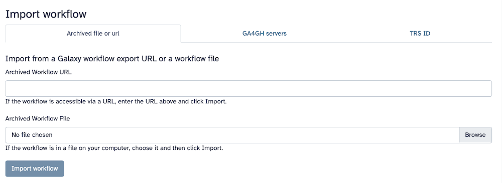

   You can find a collection of pre-existing workflows from:

- `WorkflowHub <https://workflowhub.eu/>`_
  
  - This is a hub for scientific workflows not associated with CWIC or any affiliated institutions, but many still find it a helpful resource.

- `Galaxy Training Network <https://training.galaxyproject.org/>`_
  
  - This is the Galaxy Training Network associated with CWIC and its affiliated institutions.
  - Under "Methodologies," you can find a wide variety of workflows and toolsets you can construct workflows from.

  To utilize these:

  - Click **Download.ga** (the Galaxy workflow file)
  - Upload it using the **Import** button in Galaxy

Other ways to import workflows:

- **Paste a workflow URL**

    - You can paste a URL to a Zenodo workflow or a workflow hosted on another instance of Galaxy.

- **GA4GH Servers (Global Alliance for Genomics and Health)**

    - This is where you can pull workflows from the GA4GH, a global standards-setting body for genomic data sharing.
    - There is a tab for querying its Tool Registry Servers (TRS) on Dockerstore.

- **TRS ID (Tool Registry Servers ID)**
    - You can also import directly from the GA4GH’s servers through TRS IDs and URLs directly.

Creating Your Own Workflow
--------------------------
The CFDE workspace also allows you to **create your own workflows**, which allows you to tailor your pipeline to your specific needs, reproduce that pipeline, and share it with other users. 

Below, we will walk you through the process of creating a pipeline for detecting antibiotic-resistant genes (ARGs) from metagenomic sequencing data (ex: stool sample reads) from publicly-available datasets. 

We will be using data from the dataset: https://zenodo.org/records/6543357

*Don’t worry if you aren’t familiar with these specific terms–this tutorial is designed to teach you how to create a workflow regardless of domain-specific knowledge.*

**Step 1. Create a workflow**
Click the ‘create’ tile in the upper right corner. You will be taken to a screen like this:

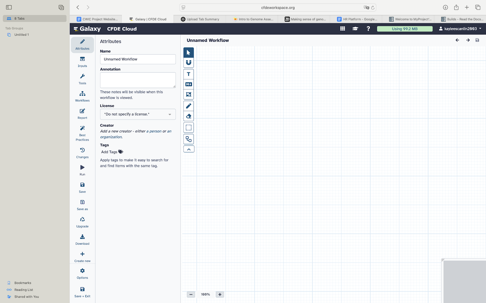

We are going to name our Workflow *Antibiotic Gene Resistance (ARG) Detection in Human Gut Microbiome. *

**Step 2. Download dataset we will be using for Workflow.**
All workflows take input data to process. To test our workflow to see if it works, we’ll need to upload a dataset to the CFDE workspace.

Download the Metagenomic benchmarking dataset for AMR detection from Zenodo here:

https://zenodo.org/records/6543357

 Specifically, you will need to save the following compressed FastQ (.fq.gz) files to your local machine:

    - simulated_metagenome_1.fq.gz
    - simulated_metagenome_2.fq.gz

.. note::
    Warning–this dataset will take a long time (~15 minutes) to download. You may need to wait for this to download to your machine to properly upload it to CFDE.

Unzip them on your local machine, then upload them using the **‘Datasets’** tab as a **collection** dataset. When they are finished uploading, click **build:**

You will now see this under the Datasets and Histories tabs.

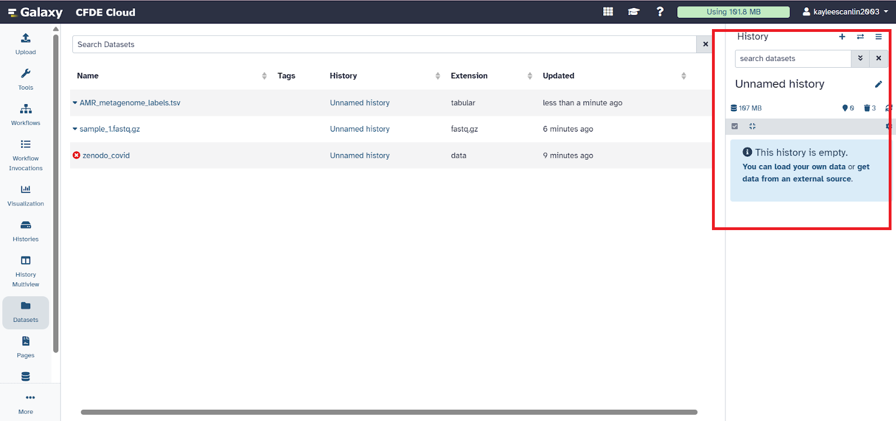

**Step 3. Add quality control tools**
Navigate back to **‘workflows’** and click on the workflow we have created. Click the ‘edit’ button. 

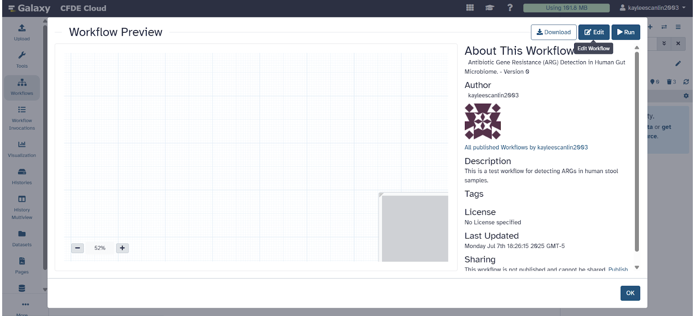

When you open your workflow, you will see a multitude of tools on the sidebar:

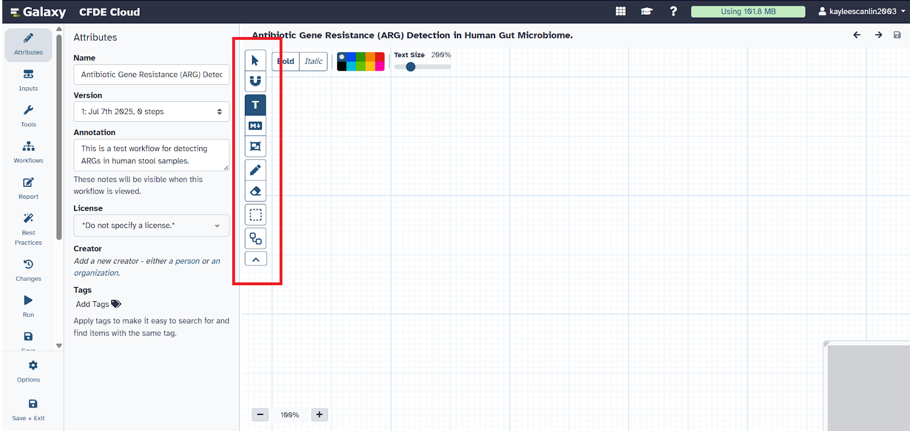

- **Pointer tool** - Click to select and move tools, inputs, outputs, and comments on the canvas. 

- **Activate Snapping** - Snap elements to a grid or other objects.

- **Text** - Add plain text annotations.

- **Markdown Comment** - Add Markdown-formatted comments.

    - Use this if you want rich formatting in your comments or section headers in your workflow–essentially text comments with italics, bold, and superscripts.

**Frame Comment** - Create a visual grouping through drawing rectangle frames around objects.

**Freehand Pen** - Draw freehand lines for custom annotations.

**Freehand Eraser** - Erase freehand drawings.

**Box Select** - Select multiple elements at once.

**Auto Layout** - Automatically arrange all steps and tools using AI.

As you can see, the Workflow editor is almost like a Figma board, where you can see and **edit the steps to your workflow in real-time with a GUI.**

Now that we are in the workflow edit screen, click the Tools button on the main sidebar (furthest to the right), and the tools list should pop up next to the workflow editor screen:

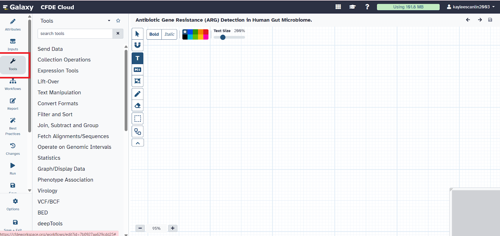

We will be using a QIIME-based workflow for our genomic analysis. First, click on the far right tab under ‘tools’ and search for **qiime2 tools import.** This is an abstracted representation of our input dataset, and will allow us to upload data into our pipeline to work with qiime2 in .qza form.

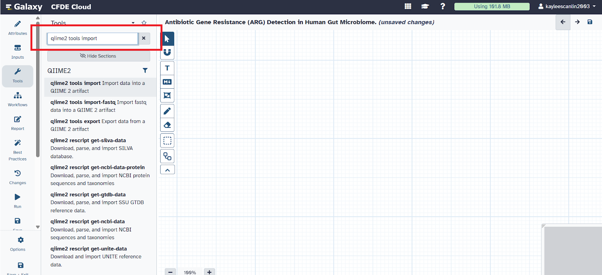

Upon clicking on it, you should see the following tab appear in your workspace:

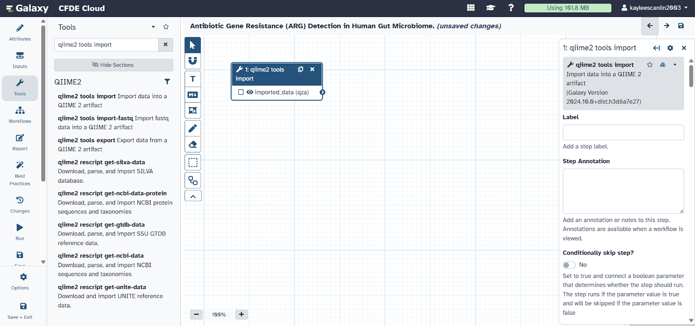

On the far right screen, you can choose to add labels, step annotations, and other metadata for this step of your workflow to look back on, but these will not change the actual contents of the dataset. That’s because this object specifically refers to the abstracted step in the workflow where it takes in data. 

Next, go to the toolbar and search for **qiime2 cutadapt trim-paired.** Add it to your workflow:

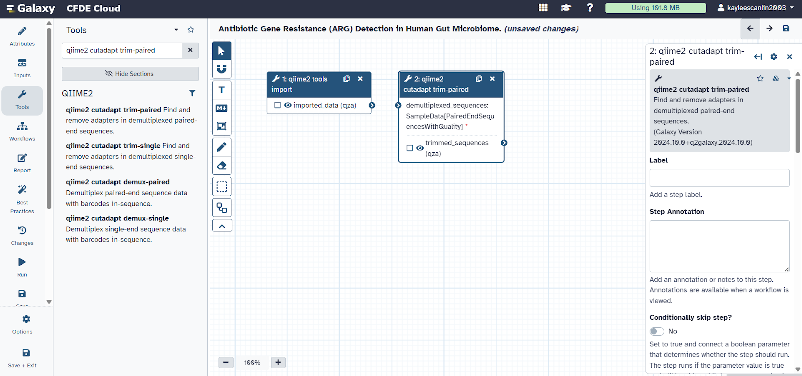

Click on the tiny arrow button to the right of the box and drag it to connect to the qiime2 cutadapt trim-paired box:

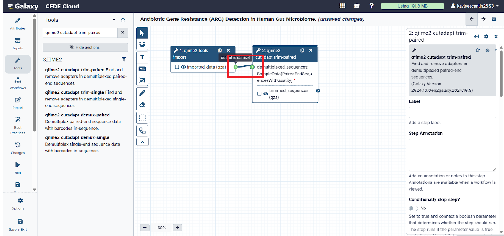

**Qiime2 cutadapt trim-paired** trims unwanted adapter sequences and primers from your raw reads. 

Residual adapter or primer contamination can affect quality filtering and downstream analysis, so this tool is crucial to clean up the reads. It processes both forward and reverse reads simultaneously, ensuring synchronization between read pairs. This step improves data quality and read alignment in subsequent steps.

**The arrows to the left of the boxes representing different steps in the workflow stand for inputs, while the arrows to the right represent the outputs of each step.** Here, the tool qiime2 tools import only has one output (the converted .fq.qz paired dataset) and zero inputs from other pipeline steps (because it is the tool that retrieves the dataset from another part of Galaxy), while qiime2 cutadapt trim-paired has one output.

Now go back to tools, and import and connect, in order:

1. **qiime quality-filter q-score**

   a. **Input(s):** Trimmed reads (.qza)

   b. **Output(s):** .qza files

2. **qiime2 dada2 denoise-paired**

   a. **Input(s):** Filtered reads (.qza)

   b. **Output(s):** Feature table (.qza) + representative sequences (.qza)

3. **qiime2 feature-table filter-features**

   a. **Input(s):** Feature table (.qza)

   b. **Output(s):** Filtered feature table (.qza)

4. **qiime2 feature-classifier classify-sklearn**

   a. **Input(s):** Rep sequences (.qza) + custom-trained ARG classifier

   b. **Output(s):** Taxonomy (.qza)

5. **qiime2 taxa barplot**

   a. **Input(s):** Taxonomy (.qza) or Feature Table

   b. **Output(s):** Final .qzv file containing visualized data

**Your workflow should look like this:**

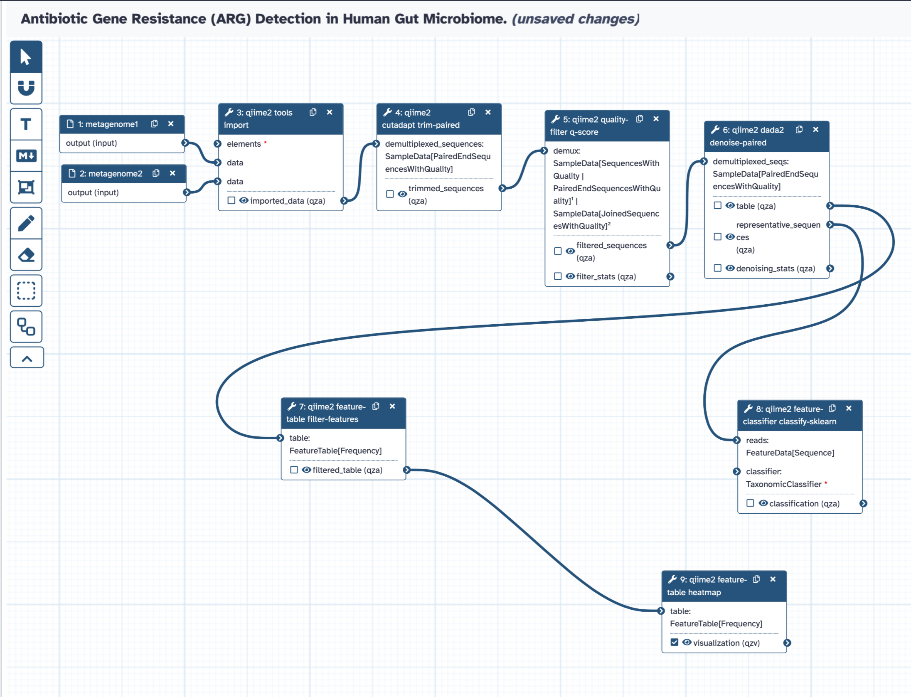

**Set correct input/output parameters**
This is the basic structure of our workflow, but some of the tools have multiple kinds of input/output, so we’ll need to set the correct ones for our specific workflow. Click on the following tabs and change the settings:

**1. qiime tools import**

When you click on this, you should see a sidebar where you can set the labels, step annotations, etc. pop up:

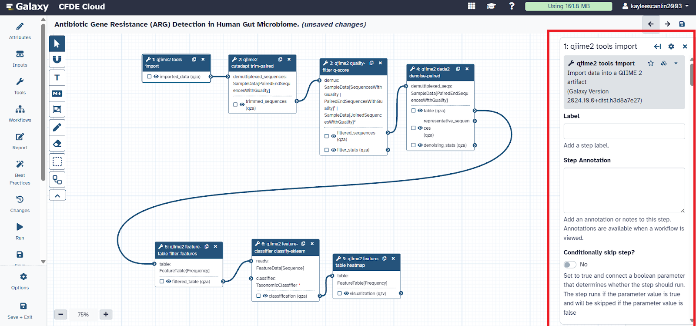

Hover over the sidebar and scroll down until you see **Tool Parameters:**

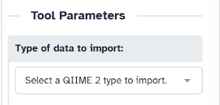

Change the input data type to **SampleData[PairedEndSequencesWithQuality]**, the kind of dataset we uploaded. Leave the default settings as is and collapse the sidebar.

Your qiime tools import tab should now look like this and take 2 input datasets as input:

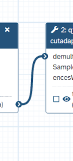
   
Now, click on **qiime2 dada2 denoise-paired** tab and change the values of **trunc_len_f** and **trunc_len_r** to appropriate integer values. For this workflow, change them to **trunc_len_f = 240** and **trunc_len_r = 200**.

.. note::
    **Choosing trunc_len** Values
    240 and 200 will work for this workflow, but these values are gathered using FastQC.
    If you’re unsure, do this first:
        - Run FastQC on your uploaded .fastq files (it’s in Tools → Quality Control).
        - Look at the Per base sequence quality graphs.
        - Truncate where the average quality drops below ~Q30.
        
Click out of the tool to save.

**Workflow summary**

**1. qiime2 tools import**

This tool is the gateway into QIIME2. It converts your raw sequencing data — in this case, paired-end FASTQ files — into QIIME2's .qza artifact format. This is essential because QIIME2 workflows require data to be in artifact form to ensure provenance tracking and compatibility with its internal tools. When working with paired-end demultiplexed reads, you provide a manifest file that maps each sample to its corresponding forward and reverse read files. This tool ensures the data structure is correct and prepares it for downstream processing.

**2. qiime2 cutadapt trim-paired**

This step trims unwanted adapter sequences and primers from your raw reads. Residual adapter or primer contamination can affect quality filtering and downstream analysis, so this tool is crucial to clean up the reads. It processes both forward and reverse reads simultaneously, ensuring synchronization between read pairs. This step improves data quality and read alignment in subsequent steps.

**3. qiime2 quality-filter q-score**

After trimming, this tool filters reads based on their quality scores. Poor-quality reads, especially those with low Phred scores toward the 3' end, can introduce errors in sequence denoising and classification. This tool evaluates per-base quality and removes sequences that fall below a chosen threshold. The result is a cleaner dataset that more accurately reflects the underlying biological sequences.

**4. qiime2 dada2 denoise-paired**

This is one of the most critical steps. DADA2 denoising corrects sequencing errors and collapses similar reads into amplicon sequence variants (ASVs), which are high-resolution alternatives to traditional OTUs. It also removes chimeric sequences and calculates a feature table — a matrix of ASV counts across your samples — as well as representative sequences. This tool effectively transforms noisy read data into biologically meaningful units for analysis.

**5. qiime2 feature-table filter-features**

This tool allows you to refine your dataset by filtering out rare features or those associated with low-depth samples. These might represent sequencing noise, contaminants, or non-informative artifacts. Filtering can be based on abundance, prevalence, or sample metadata. This step helps reduce noise and makes statistical analyses and visualizations more robust and interpretable.

**6. qiime2 feature-classifier classify-sklearn**

Here, you use a machine learning model — a naïve Bayes classifier — to assign taxonomy to your representative sequences. In the context of ARG detection, you would train this classifier on a custom antibiotic resistance gene (ARG) database like CARD, ResFinder, or ARG-ANNOT. Once trained, the classifier matches your ASVs to known ARG categories, producing a .qza taxonomy file that links your sequences to specific ARGs. This is how you derive biological meaning from your sequencing results.

.. note::
    This step will require an additonal upload of a **classifier model** to work!
    Download the classifier here:
    
    https://data.qiime2.org/2024.2/common/silva-138-99-515-806-nb-classifier.qza
    
    *This will start a direct download in your browser.
    
    When you have downloaded it, upload it into the CFDE Galaxy using the **Upload** box, then click **Step 8: classify-sklearn**, and change the model under **classifier** to the model you just uploaded.
    
.. note::
    The CFDE Galaxy is still in development, so there may not be a way for you to upload this classifier model yet.
    
    

**7. Qiime2 feature-table heatmap**

This tool is for visualization and interpretation.Feature-table heatmap provides a visual matrix of ARGs by sample, allowing you to quickly assess presence, abundance, and clustering. These outputs (.qzv files) can be viewed in Galaxy or QIIME2 View and are essential for sharing and interpreting your results.

Congratulations! Now you have a completed workflow. Now **let's add the input:**

Click on the **inputs** tab on the far right and search for the **Input Dataset object.** Add two (one for simulated_metagenome_1.fq.gz and one for simulated_metagenome_2.fq.gz) and connect to our qiime2 tools import tab:

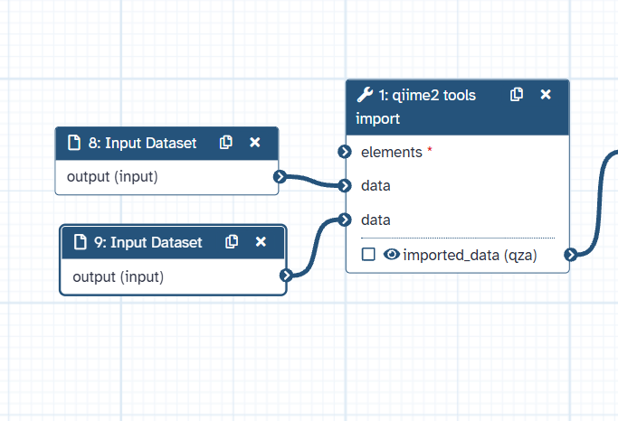

You can rename these in the parameter sidebar if you wish for clarity purposes:

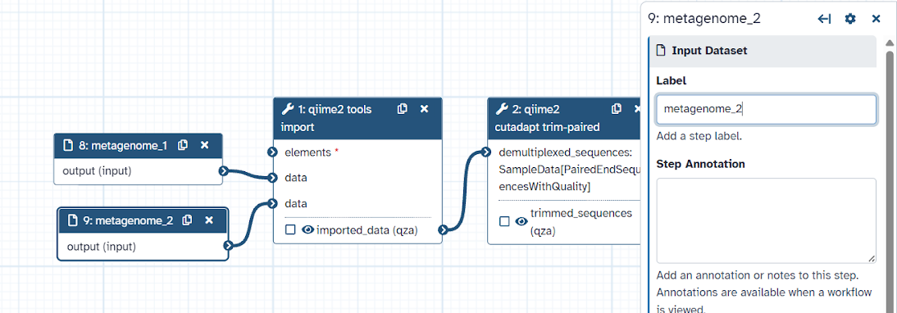

Click **save + exit** on the far left toolbar to save our changes and return to the home screen.

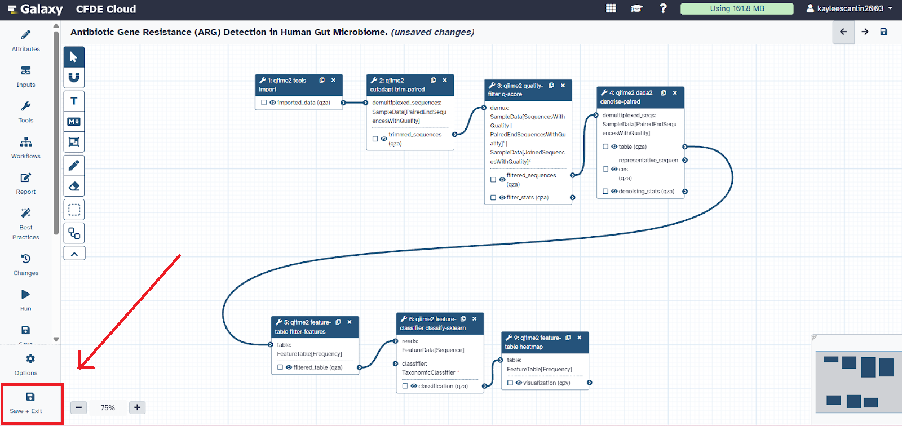

You should now see our workflow present in **Workflows:**

Congratulations! You now have a completed workflow.

Using Workflows
===============
Let's test our new workflow out.

In your **workflows** tab, mouse over the workflow you would like to run.

Click the blue arrow button in the bottom right of your workflow to run it:

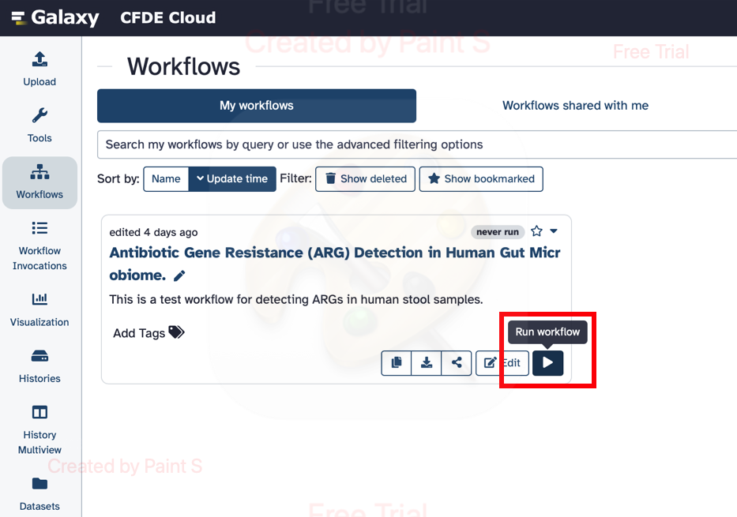
   
You should now be taken to a screen that looks like the following:

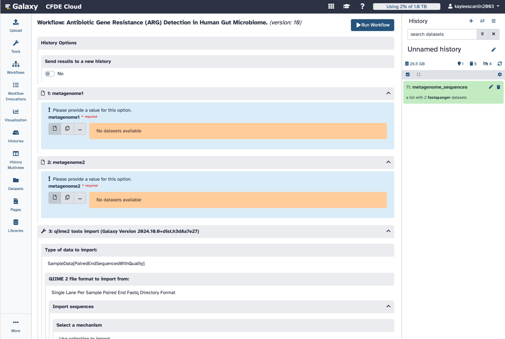
   
Here you can see the two orange alert boxes saying **no datasets available.**

For our workflow to run, we must first select a dataset to work with. Click on the first dataset input box (**metagenome_1**) to upload a dataset:

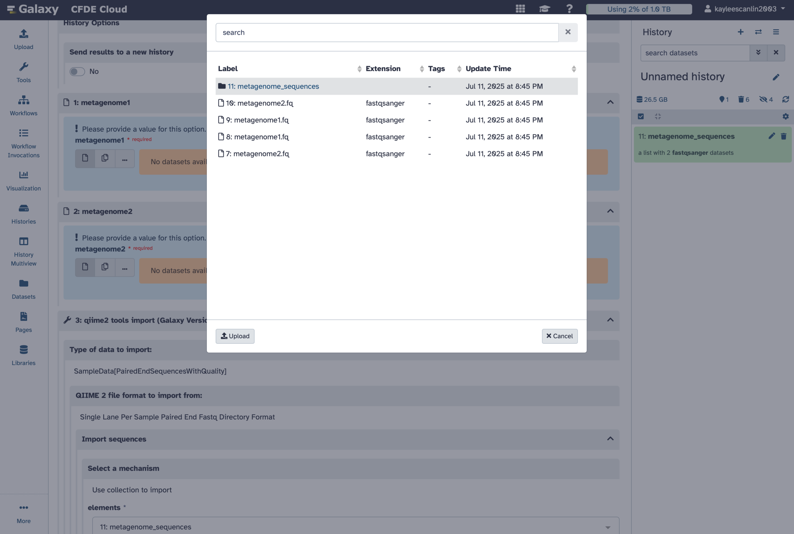

Upload our downloaded **metagenome1.fq** and **metagenome2.fq** datasets to each tab respectively, then click **run workflow.**

Workflow Outputs
----------------
Any outputs to your workflow should be in the **History** tab to the right, including any .CSV, .XLSX, and .PNG files of graphs.

Click the name of an output in the history panel to:
    - View metadata
    - See logs or error messages
    - View the contents (if viewable)
    - Download the file
    
Workflow Reports
----------------
Once you run a workflow for the first time, a new tab called **Workflow Reports** should pop up on the far right sidebar. You should be able to access a full report of your workflow here.
    
Workflow Invocations
--------------------
In the CFDE Galaxy workspace, a workflow invocation refers to the execution of a workflow. Each time a user runs a workflow, Galaxy logs the invocation along with detailed metadata, including the input datasets, output datasets, workflow version, runtime status, and timestamps.

This feature allows users to monitor the progress of their analyses, identify any errors, and reproduce or re-run previous workflow executions with ease. It serves as a comprehensive audit trail for workflow-based analyses.

Now that you know how to create and run your own workflow, click the next page to learn about the other tabs on the sidebar.

