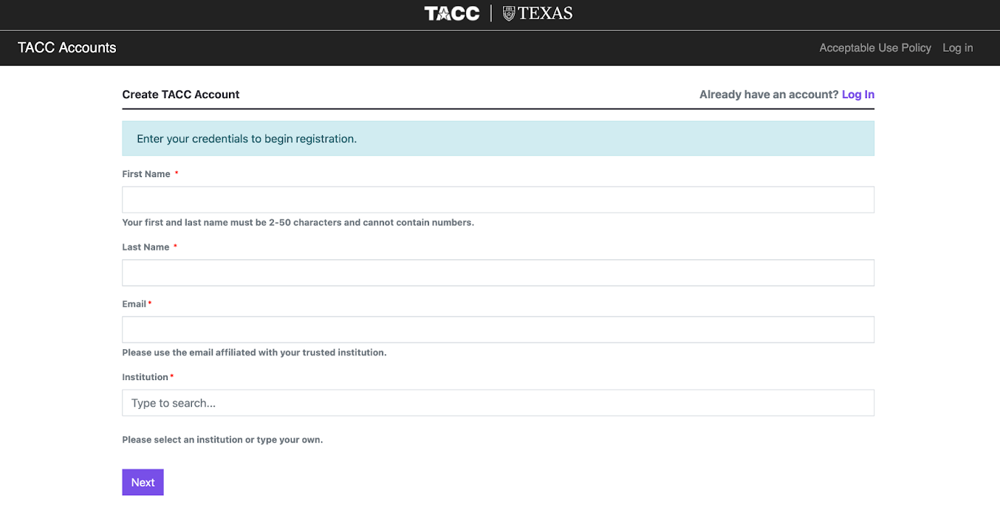
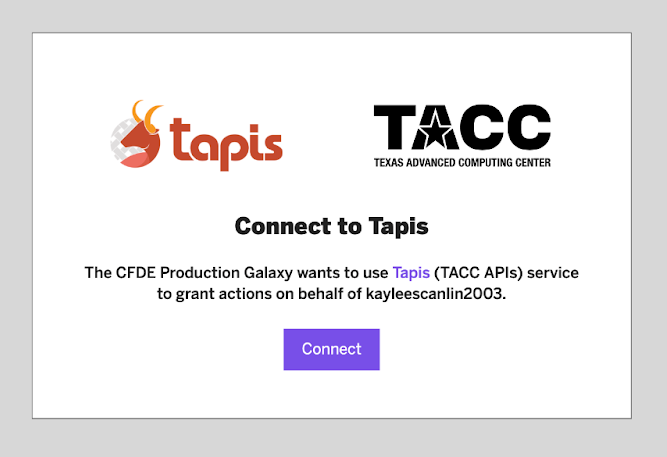
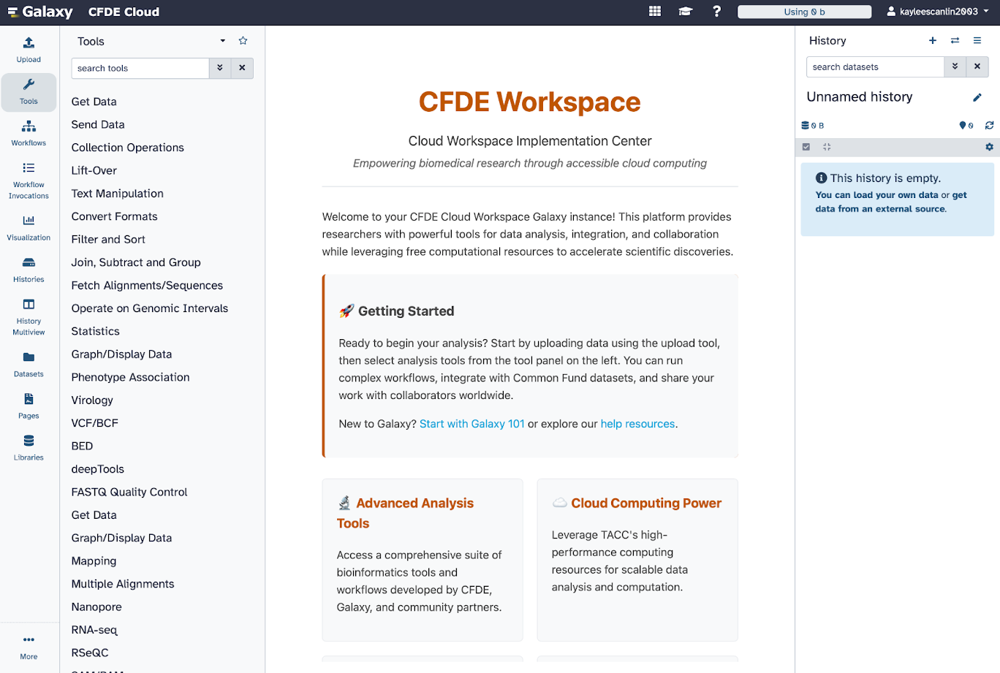
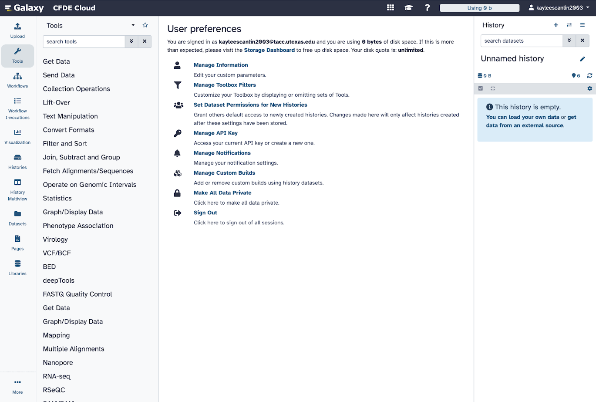
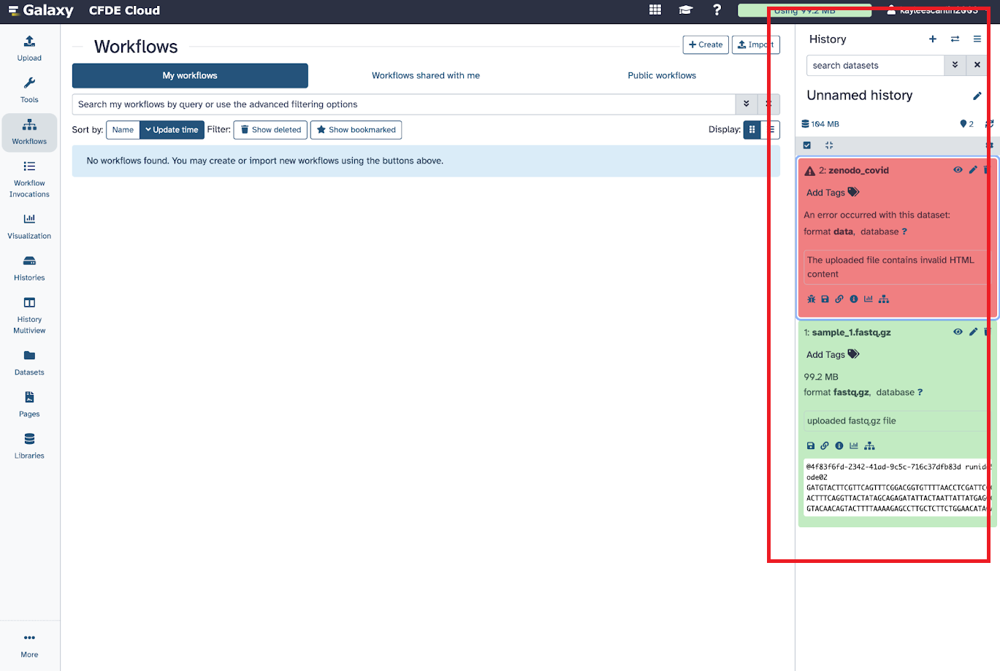

Welcome to the CWIC Workspace!
=============================
Purpose
-------
The Common Fund Data Ecosystem (CFDE) platform is a workspace where researchers can access High-Performance Computing (HPC) compute time for large-scale data analytics and machine learning projects, for free.
 Built in collaboration with the Texas Advanced Computing Center (TACC’s) HPC systems and the NIH’s suite of scientific tools, it is meant to assist researchers in computationally-heavy task whilst offering the 
 functionality of several pre-developed research tools in the same suite.

To learn more about the CFDE, click here: https://commonfund.nih.gov/dataecosystem 

Accessing CFDE Galaxy
--------------------
Access the website through: https://cfdeworkspace.org/<https://cfdeworkspace.org/

Galaxy
-------------------
Galaxy is the web-based platform for data analysis the CFDE workspace is run on. When you see tutorials over Galaxy, know that they apply to the CFDE workspace as well.

For more information about Galaxy, click here:

Or click on the See Galaxy Training Materials icon on the top right of the CFDE Galaxy.

Creating an Account
-------------------
**1. Navigate to https://cfdeworkspace.org/**

Here you should see a log-in page. If you have an account with CFDE already, log in using your username and password. If not, click ‘create account’ to create an account with TACC.

.. image:: _static/homepage-images/login1.png
   :alt: Tapis login
   :width: 1000px

You will then be taken to a page on the TACC website:

**Your request to create a TACC account may take up to 48 hours.**
More information about creating a TACC account: https://tacc.utexas.edu/use-tacc/getting-started/

Once you have successfully logged in, you should see this screen:

Click ‘Connect’. 
When you have your account set up, you should be taken to **this** homepage:

User Settings
-------------
To change anything about your account, you need to go into your account settings. To go into your account settings, click on your username in the top right. It should bring you to ‘User Preferences’:

Here, you can:

- **Manage Information** – Manage your personal information.
- **Manage Toolbox Filters** – Customize your toolbox.
- **Set dataset permissions**
- **Manage API keys** – For interacting with other applications using CFDE Cloud.
- **Manage notification settings**
- **Manage custom builds**
- **Make data private**
- **Sign Out**

History
-------
There is a toggle-able history sidebar on the right that will display recent activity in the CFDE galaxy portal, as well as their statuses and any error messages that might pop up.

.. note::
    If this gets in the way, you can delete using the trash can icon to clear the history tab. (Your data will still be stored under 'datasets'.)

Sidebar
-------
You may notice there is a sidebar of tools to the far right. 
Click 'next: Sidebar Tools' for information on how to use them.

.. toctree::
   :maxdepth: 2
   :caption: Other pages:

   /Sidebar/Sidebar
   /Creating a Workflow/creating-workflow
   

