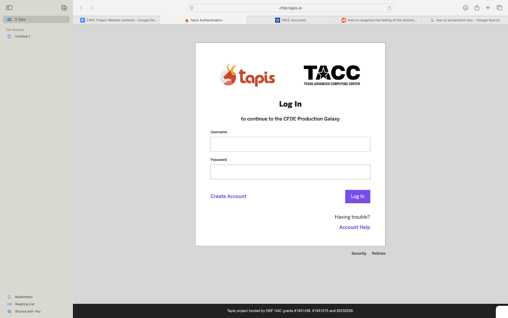

Welcome to the CWIC Workspace!
=============================
Purpose
-------
The Common Fund Data Ecosystem (CFDE) platform is a workspace where researchers can access High-Performance Computing (HPC) compute time for large-scale data analytics and machine learning projects, for free.
 Built in collaboration with the Texas Advanced Computing Center (TACC’s) HPC systems and the NIH’s suite of scientific tools, it is meant to assist researchers in computationally-heavy task whilst offering the 
 functionality of several pre-developed research tools in the same suite.

To learn more about the CFDE, click here: https://commonfund.nih.gov/dataecosystem 

Accessing CFDE Galaxy
--------------------
Access the website through: https://cfdeworkspace.org/<https://cfdeworkspace.org/

Galaxy
-------------------
Galaxy is the web-based platform for data analysis the CFDE workspace is run on. When you see tutorials over Galaxy, know that they apply to the CFDE workspace as well.

For more information about Galaxy, click here:

Or click on the See Galaxy Training Materials icon on the top right of the CFDE Galaxy.

Creating an Account
-------------------
**1. Navigate to https://cfdeworkspace.org/**

Here you should see a log-in page. If you have an account with CFDE already, log in using your username and password. If not, click ‘create account’ to create an account with TACC.

.. toctree::
   :maxdepth: 2
   :caption: Contents:

   /Sidebar/Sidebar

